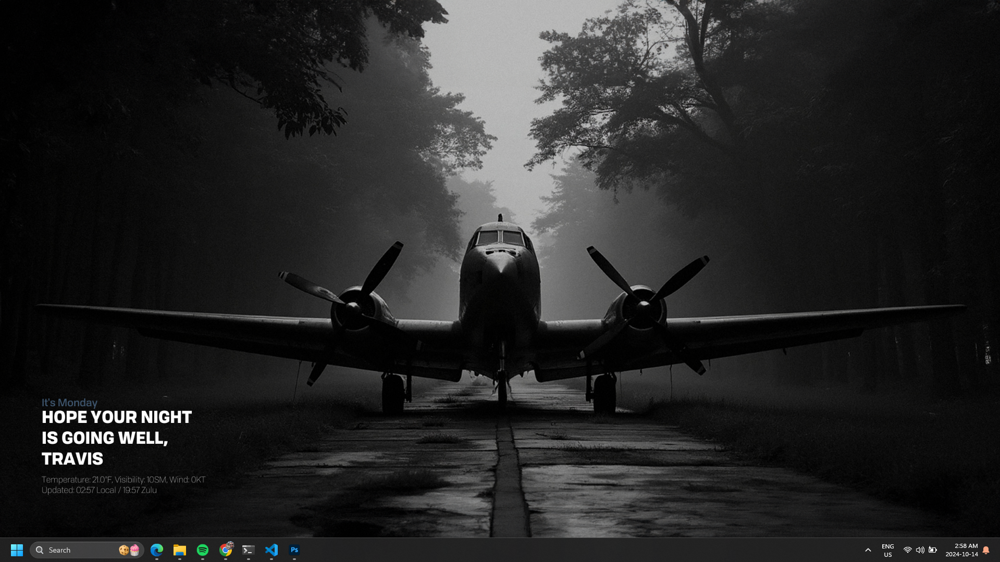

# Donkey

**Donkey** is a lightweight, customizable desktop wallpaper generator designed to fetch weather information and update your desktop wallpaper every 15 minutes. It's inspired by Conky, but Donkey is intentionally simpler and lighter ("it's like Conky, but it's ass"). Donkey supports multiple desktop environments and window managers, and it's ideal for users who prefer a low-impact utility that runs periodically and quietly updates the desktop background.

My default theme is an airplane inspired design, I hope to make this more flexible in the future. 



## Features

- Fetches and displays current weather information using METAR data.
- Automatically updates the desktop background every 15 minutes.
- Lightweight, only runs periodically, minimizing resource usage.
- Supports both Local and Zulu (UTC) time.
- Runs on multiple desktop environments and window managers.

### Supported Environments

Donkey can set wallpapers on the following environments:

- **Windows**
- **macOS**
- **GNOME**
- **KDE**
- **Cinnamon**
- **Unity**
- **Budgie**
- **XFCE**
- **LXDE**
- **MATE**
- **Deepin**
- **Most Wayland compositors** (requires `swaybg`)
- **i3** (requires `feh`)

## How it Works

Donkey retrieves weather data from the METAR API, parses the weather information, and overlays the data along with time (both local and Zulu/UTC) onto a background image. Every 15 minutes, Donkey fetches updated data and refreshes the desktop wallpaper with the latest information. The lightweight nature of the program ensures that system resources are minimally impacted.

### Why "Donkey"?

Donkey gets its name because "it's like Conky, but it's ass." While Conky is a powerful system monitor with complex theming, Donkey is intentionally simple and focused on minimalism. In the future, we hope to introduce support for templates and themes. Donkey is lightweight and only runs every 15 minutes, which keeps system resources low.

## Installation

### Precompiled Binaries

You can download precompiled binaries for **Windows**, **macOS**, and **Linux** from the [Releases](https://github.com/teamcoltra/donkey/releases) page.

1. Download the appropriate binary for your system.
2. Extract the files to a desired location.
3. Ensure the program has executable permissions on Linux and macOS:
   ```bash
   chmod +x donkey
   ```

### Usage

Donkey works by setting a new wallpaper every 15 minutes. The program accepts flags to specify the background image and the output image path:

```bash
./donkey --airport KBFI --background /path/to/background.jpg --output /path/to/wallpaper_output.png
```

### Flags

- `--airport` (required): ICAO airport code for fetching METAR data.
- `--background` (required): Path to the base background image.
- `--output` (required): Path where the generated wallpaper will be saved.
- `--cron` (optional): If set, the program runs only once, allowing it to be integrated with cron jobs.

Example usage:
```bash
./donkey --airport KBFI --background ~/Pictures/background.jpg --output ~/Pictures/wallpaper.png
```

For **cron** integration (Linux/macOS) (COMING SOON)
```bash
*/15 * * * * /path/to/donkey --airport KBFI --background ~/Pictures/background.jpg --output ~/Pictures/wallpaper.png --cron
```

## To-Do & Future Enhancements

- **Themes & Templates**: Expand the program to support custom themes and templates for more customization.
- **Cron Integration**: Allow Donkey to run in cron mode (`--cron`) so it doesn't run continuously. This feature is useful for Linux users who want maximum efficiency.
- **Pull Requests Welcome**: If you're interested in contributing, an easy pull request would be enabling the `--cron` flag for one-time execution.

## License

This project is licensed under the MIT License - see the [LICENSE](LICENSE) file for details.

---

Donkey is a simple tool built to scratch an itch, but there's plenty of room for improvement. Feel free to contribute and help make Donkey a little less "ass"!
